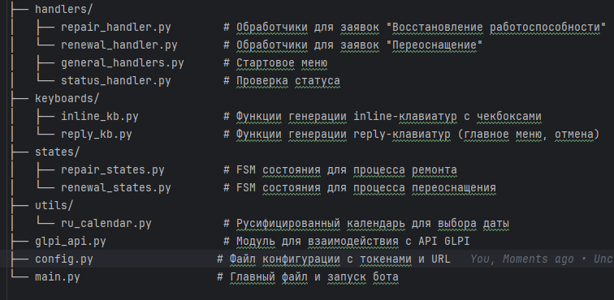

# Telegram Бот для создания заявок в GLPI

## Обзор

Этот Telegram-бот предназначен для упрощения процесса создания сервисных заявок в GLPI (Gestionnaire Libre de Parc Informatique — свободный менеджер ИТ-инфраструктуры). Он позволяет пользователям отправлять запросы на "Восстановление работоспособности" и "Переоснащение", проводя их через интерактивный диалог. После сбора всей необходимой информации бот автоматически создает новую заявку в настроенном экземпляре GLPI.

Бот использует библиотеку `aiogram` для взаимодействия с Telegram Bot API, включая FSM (конечный автомат) для управления состояниями диалога и пользовательские клавиатуры для удобства ввода.

## Возможности

- **Интерактивное создание заявок**: Пошаговое руководство для подачи заявок на ремонт и переоснащение.
- **Управление состояниями**: Использует `aiogram` FSMContext для управления ходом заполнения форм.
- **Пользовательские клавиатуры**:
  - Reply-клавиатуры для навигации и отмены операций.
  - Inline-клавиатуры с чекбоксами и кнопкой "Прочее (вручную)" для выбора проблем и типов работ.
- **Запрос дополнительных данных**: Сбор деталей — номер поезда, вагон, оборудование, описание проблемы/работы, место проведения, дата и время, исполнитель.
- **Интеграция с русифицированным календарем**: Используется `RuSimpleCalendar` для удобного выбора даты.
- **Интеграция с GLPI**: Автоматическое создание заявок в GLPI через API.
- **Валидация и обработка ошибок**: Проверка корректности ввода и информирование о проблемах с созданием заявок.

## Структура проекта



## Ключевые модули

### keyboards/inline_kb.py

Основная функция:

- `get_checkbox_kb_with_other(options: list, selected: list = None, prefix="default")`

  - Формирует inline-клавиатуру с чекбоксами для списка опций.
  - Для выбранных опций отображается "✅", для остальных — "⬜".
  - Добавляет кнопки "Готово" и "Прочее (вручную)".
  - `prefix` используется как префикс для callback_data, чтобы различать разные контексты (например, `repair_`, `renewal_`).

### keyboards/reply_kb.py

Функции для основных reply-клавиатур:

- `get_main_menu_kb()` — главное меню с кнопками "Создать заявку" и "Проверить статус заявок".
- `get_claim_type_kb()` — выбор типа заявки: "Восстановление работоспособности", "Переоснащение", "Отменить".
- `get_cancel_kb()` — кнопка "Отменить" для выхода из любого диалога.

### states/repair_states.py

Определяет состояния FSM для заявки по восстановлению работоспособности:

- `train_number`, `wagon_number`, `wagon_sn`, `equipment_in` — ввод данных по поезду и оборудованию.
- `problem_types` — выбор проблем (список).
- `problem_other` — ручной ввод проблемы.
- `location`, `date`, `time`, `datetime` — место и время работ.
- `executor_name`, `executor_position` — данные исполнителя.

### states/renewal_states.py

FSM состояния для заявки по переоснащению:

- `train_number`, `wagon_number`, `wagon_sn`, `equipment_in` — данные по поезду и старому оборудованию.
- `work_types` — выбор типов работ (список).
- `work_other` — ручной ввод типа работы.
- `new_equipment` — наименование нового оборудования.
- `quantity` — количество нового оборудования.

### handlers/repair_handler.py

Управляет процессом создания заявки на восстановление:

- Запрашивает данные поэтапно.
- Позволяет выбрать или вручную ввести проблемы.
- Позволяет выбрать дату через календарь и время (из списка или вручную).
- По завершении — создаёт заявку в GLPI через API и сообщает номер заявки пользователю.

### handlers/renewal_handler.py

Управляет процессом создания заявки на переоснащение:

- Аналогично repair_handler, но с собственным набором параметров (типы работ, новое оборудование, количество).
- В конце создаёт заявку в GLPI и информирует пользователя.

### handlers/status_handler.py

Реализует проверку статуса заявок в GLPI:

- Запрашивает ID тикета у пользователя
- Валидирует формат введенного ID
- Получает данные из GLPI API
- Преобразует статус в читаемый формат (см. ниже)
- Форматирует ответ с ключевой информацией о заявке (например, название, статус, исполнитель, приоритет, дата создания и пр.)
- Обрабатывает ошибки подключения к GLPI и неправильные запросы пользователя

# Пример маппинга статусов
status_map = {
    '1': 'Новая',
    '2': 'В обработке (назначено)',
    '3': 'В обработке (планируется)',
    '4': 'Ожидание',
    '5': 'Закрыто'
}

### keyboards/inline_kb.py

- Создаёт inline-клавиатуры для Telegram с чекбоксами (в том числе с поддержкой "прочек" и кнопок "Готово" / "Прочее (вручную)").
- Позволяет пользователю легко выбирать несколько вариантов, подтверждать или вводить свой.

### keyboards/reply_kb.py

- Формирует основное меню, меню выбора типа заявки, а также клавиатуру для быстрого отмена операции.

### states/repair_states.py и states/renewal_states.py

- Определяют шаги FSM для организации диалога и последовательного заполнения формы соответственно для заявки на восстановление и переоснащение.

### utils/ru_calendar.py

- Русифицированная версия компонента календаря для aiogram, обеспечивает интуитивный выбор даты прямо в чате.

### glpi_api.py

- Интерфейс для подключения к GLPI, авторизации и прямой работы через HTTP-запросы к API.
- Включает функции для создания заявок, получения информации о них, обработки ошибок и др.


## Интеграция с GLPI

- Соединение через функцию `connect` из `glpi_api.py`, используя URL GLPI, app token и user token.
- Создание заявки через метод `add` с параметрами:
  - `name` — название заявки.
  - `content` — подробное описание.
  - `urgency`, `impact`, `priority` — параметры приоритетов.
  - `type`, `requesttypes_id`, `itilcategories_id`, `entities_id` — служебные параметры для GLPI.
- При успешном создании — бот сообщает ID новой заявки.
- При ошибках — пользователь получает сообщение об ошибке, а детали логируются.

## Взаимодействие с пользователем через Telegram

- Используется Reply-клавиатура для главного меню и выбора типа заявки.
- Для выбора проблем или видов работ — Inline-клавиатура с чекбоксами и кнопкой "Прочее (вручную)".
- Диалог разбит на последовательные шаги с автоматическим переходом между состояниями.
- Календарь для выбора даты и кнопки для выбора либо ручного ввода времени.
- Команда "Отменить" доступна на всех этапах для прерывания процесса.

## Как настроить и запустить

1. Клонируйте репозиторий:
    ```bash
    git clone <URL-репозитория>
    cd <папка-репозитория>
    ```

2. Создайте виртуальное окружение и активируйте:
    ```bash
    python -m venv venv
    source venv/bin/activate  # Для Windows: venv\Scripts\activate
    ```

3. Установите зависимости:
    ```bash
    pip install -r requirements.txt
    ```
    В `requirements.txt` должны быть, например:
    ```
    aiogram>=3.0.0
    aiogram-calendar
    requests
    python-dotenv
    ```

4. Создайте и заполните файл `config.py`:
    ```python
    import os
    from dotenv import load_dotenv
    load_dotenv()

    BOT_TOKEN = os.getenv("BOT_TOKEN")          # Токен Telegram бота
    GLPI_URL = os.getenv("GLPI_URL")            # URL API GLPI
    GLPI_APP_TOKEN = os.getenv("GLPI_APP_TOKEN")# App token GLPI
    GLPI_USER_TOKEN = os.getenv("GLPI_USER_TOKEN") # User token GLPI
    ```

5. Запустите бота командой:
    ```bash
    python main.py
    ```

## Рекомендации

- Протестируйте бота в закрытом чате перед запуском в продуктиве.
- Проверьте корректность токенов и доступа к GLPI API.
- Желательно настроить логирование для отслеживания ошибок.

---


